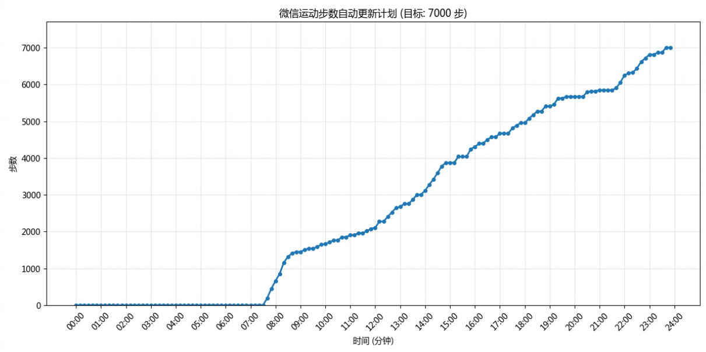

# 微信运动步数自动更新工具

> 声明：本项目仅用于学习交流，如本项目内容涉及您的权益，请联系我，我将立即删除相关内容。

## 功能说明

这个工具可以修改和自动更新微信运动步数，模拟一天中真实的运动。

## 工作原理

本工具通过利用 Zepp 应用的漏洞来更新步数，然后同步到微信运动。微信运动可以添加外部步数数据源，当有多个数据源时会选择最高的步数显示。

工具通过调用 Zepp 的步数更新 API 来实现步数修改：
```
curl -X POST "https://wzz.wangzouzou.com/motion/api/motion/Xiaomi" \
  -H "Origin: https://m.cqzz.top" \
  -H "Referer: https://m.cqzz.top/" \
  -H "User-Agent: Mozilla/5.0 (Linux; Android 13; Pixel 7) AppleWebKit/537.36 (KHTML, like Gecko) Chrome/139.0.0.0 Mobile Safari/537.36" \
  -H "Content-Type: application/x-www-form-urlencoded; charset=UTF-8" \
  --data "phone=xxx&pwd=xxx&num=10000"
```

**注意**：API地址可能会变更，如果遇到无法连接的情况，请通过配置文件的 `api_url` 更新API地址。

## 使用教程

### 1. 下载并安装 Zepp 应用

1. 打开手机应用商店（App Store 或 Google Play）
2. 搜索并下载 "Zepp" 应用
3. 安装完成后打开软件

### 2. 注册并登录账号

1. 在 Zepp 应用中选择注册账号
2. **重要提示**：
   - 不要使用小米账号登录
   - 不要使用第三方登录
   - 必须使用邮箱注册并登录

### 3. 绑定微信/支付宝

1. 进入 Zepp APP
2. 找到 "我的" > "第三方接入"
3. 选择 "微信" 或 "支付宝"
4. 根据提示完成绑定操作

**注意**：一个 Zepp 账号只能绑定一个微信或支付宝账号。

建议在手机设置中关闭微信的获取步数权限，因为真实的步数也会被同步到微信，导致本工具失效，关闭微信的获取步数权限之后，微信就只能从Zepp获取步数数据。

## 自定义配置文件 (.env)

将 `env.example` 文件复制为 `.env` 并填入你的信息：

```bash
cp env.example .env
```

配置文件示例：
```
email=你的邮箱
password=你的密码
total_step=7000                      # 每日目标步数，默认7000
delta=0.2                           # 随机偏差系数，默认0.2
api_url=https://wzz.wangzouzou.com/motion/api/motion/Xiaomi # API地址，可根据需要更改，默认为当前可用地址
```

**配置说明**：
- `api_url`：如果API地址发生变更，可以通过修改此项来更新API地址
- 当前API地址：`https://wzz.wangzouzou.com/motion/api/motion/Xiaomi`（默认值）

## 时间表

以下是一天中每个时间点的步数计划表，步数会根据时间自动更新。累计步数比乘上总步数就是这个时间点的预期步数，时间点之间的步数可插值得到，并且引入随机偏差增强真实性。

| 时间  | 累计步数比 |
| ----- | ---------- |
| 7:30  | 0          |
| 8:30  | 0.2        |
| 11:50 | 0.3        |
| 13:00 | 0.4        |
| 14:00 | 0.45       |
| 14:40 | 0.55       |
| 17:30 | 0.7        |
| 19:00 | 0.8        |
| 21:30 | 0.85       |
| 22:30 | 0.95       |
| 23:30 | 1.0        |




## 使用方法

### 1. 安装依赖

```bash
pip install -r requirements.txt
```

### 2. 手动设置步数

```bash
python set_step.py 10000
```

### 3. 自动更新步数

```bash
python autosport.py
```

自动模式会：
- 根据时间表自动计算预期步数
- 为每分钟生成随机步数计划（添加随机性使步数更自然）
- 确保步数只增不减
- 每16分钟检查一次并更新
- 当应设置的步数与上次相同，将跳过更新
- 每天0点重新生成随机步数计划

按 `Ctrl+C` 停止自动更新。

### 4. 调试模式

```bash
python autosport.py --dryrun
```

调试模式会：
- 生成当天的步数计划但不实际更新步数
- 显示步数随时间变化的图表
- 用于验证步数计划是否符合预期

## 文件说明

- `set_step.py`: 手动设置步数的脚本
- `autosport.py`: 自动更新步数的主脚本
- `utils.py`: 共用工具函数
- `requirements.txt`: Python依赖包
- `.env`: 配置文件（需要自己创建）

## autosport.py 工作原理

1. 读取 `.env` 配置文件中的 `total_step` 和 `delta` 参数
2. 根据时间表计算一天中每分钟的预期步数
3. 为每分钟的步数添加随机负偏差（由 `delta` 参数控制）
4. 确保步数只增不减
5. 每16分钟检查当前时间并更新相应的步数
6. 每天0点重新生成随机步数计划

## 参数说明

- `total_step`: 每日目标步数，默认值为 7000
- `delta`: 随机偏差系数，控制步数的随机性，默认值为 0.2（即±20%的偏差）
- `api_url`: API服务器地址，默认值为 `https://wzz.wangzouzou.com/motion/api/motion/Xiaomi`，如果API地址变更可以修改此项

